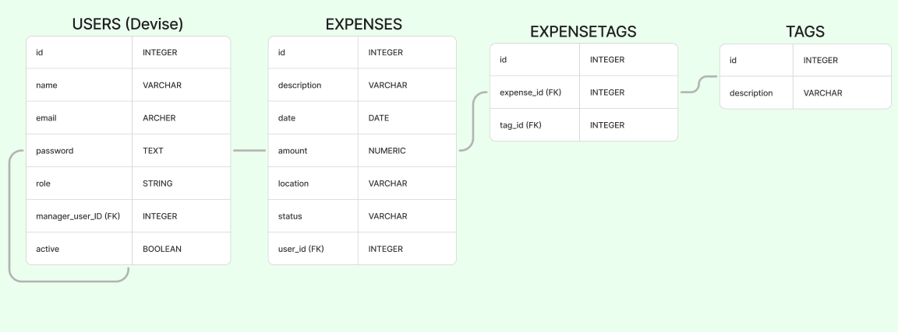

# Reembolso APP 🖥️

Projeto **Reembolso APP** para o desafio técnico da empresa [Caiena](https://www.caiena.net/). Todo projeto Reembolso APP foi desenvolvido na framework **Ruby on Rails**, construída em um único repositório e um único processo de execução, que concentra todas as responsabilidades de negócio, interface e dados no mesmo código-base Rails.

**Versão:** 1.0.0
**Link para Execução:** localhost:3000

---

## Indíce
- [Instalação](#instalação)
- [Autenticação](#autenticação)
- [Modelos](#endpoints)
    - [Users](#users)
    - [Expenses](#expenses)
    - [Tags](#tags)
- [Testes](#testes)

---

## Instalação

O projeto pode ser instalado a partir do Docker Compose. Para instalar execute:

```sh
docker compose build
docker compose up -d
docker compose exec web rails db:create db:migrate
```
É importante definir o valor da variável `RAILS_ENV` para definir em qual ambiente será feita a migration.

Com isso a API já poderá ser acessada pela sua URL padrão:

```sh
localhost:3000
```

---

## Autenticação
O projeto usa a gem **Devise** para criação e gerenciamento de autenticação. É possível criar, editar, ver e excluir usuários, além de poder acessar as rotas padrão do devise para gerenciar um usuário.

### Rotas do Devise:

#### Criar Usuário
- **Formulário de cadastro:** new_user_registration_path ()
- **Enviar cadastro:** user_registration_path
- **Acesso:** GET `/users/sign_up`

#### Editar Usuário
- **Formulário de edição:** edit_user_registration_path
- **Atualizar cadastro:** user_registration_path
- **Acesso:** PUT/PATCH `/users`

#### Excluir Usuário
- **Excluir cadastro:** user_registration_path
- **Acesso:** DELETE `/users`

#### Login
- **Formulário de login:** new_user_session_path
- **Enviar login:** user_session_path
- **Acesso:** GET `/users/sign_in`

#### Logout
- **Enviar logout:** destroy_user_session_path  
- **Acesso:** GET `/users/sign_in`

#### Esqueci Senha
- **Formulário de recuperação:** new_user_password_path
- **Atualizar senha:** user_password_path
- **Acesso:** GET `/users/password/new`

---

## Modelagem
Na modelagem da aplicação foram criadas os seguintes modelos:

### User
Modelagem de usuário, criado a partir da gem **Devise**, utilizando password controlado e criptografado pela gem, com os seguintes campos:
- **E-mail**: email
- **Nome**: name
- **Tipo**: role
- **Gestor**: manager_user_id
- **Ativo**: active
- **Senha**: password (controlado e criptografado pelo **Devise**)

### Expense
Modelagem de despesas com os seguintes campos:
- **Descrição**: description
- **Data**: date
- **Valor**: amount
- **Local**: location
- **Status**: status
- **Funcionário**: user_id

### Tag
Modelagem de tags com os seguinte campos:
- **Descrição**: description

### Esquema da Modelagem


---

## Testes

Para rodar os testes, utilizar o comando abaixo:

```sh
docker compose exec web bundle exec rspec
```
